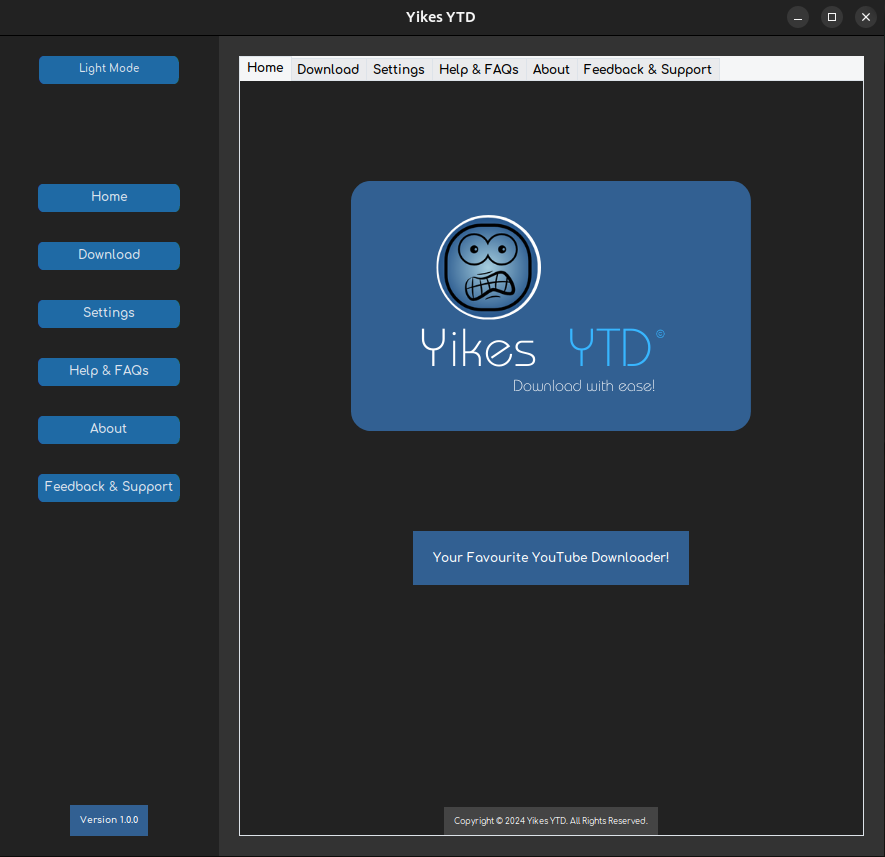
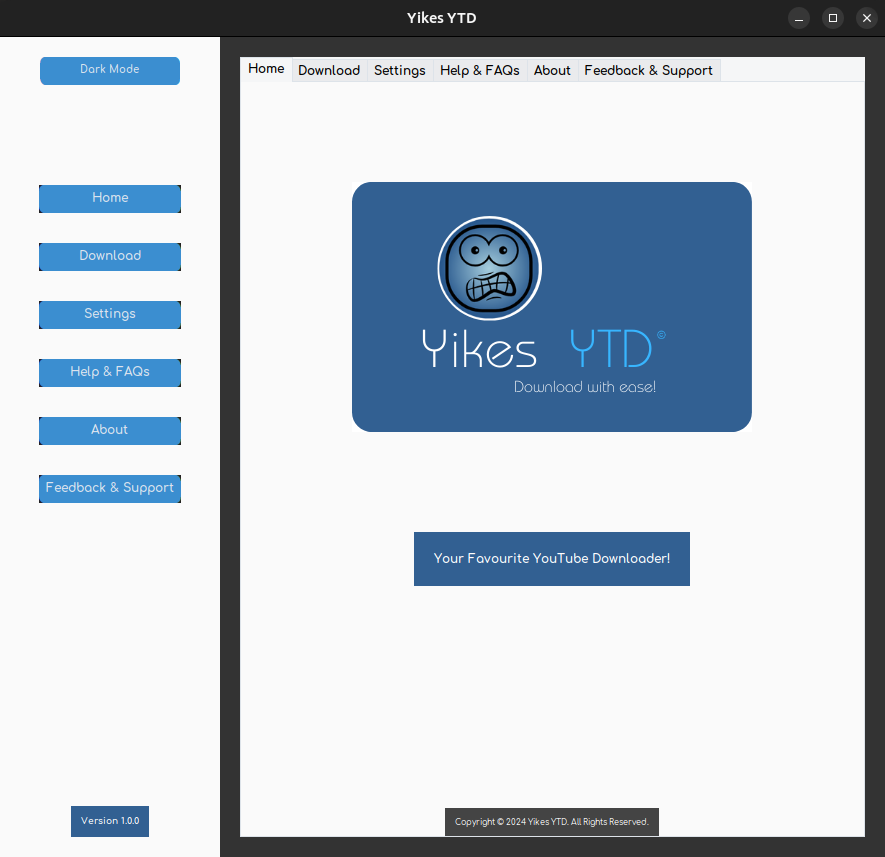

# Yikes YouTube Downloader

## Overview

The YouTube Video Downloader Application is a Python-based desktop application that allows users to easily download YouTube videos and playlists for offline viewing. It provides a simple and intuitive graphical user interface (GUI) for fetching video information, selecting desired formats, and initiating the download process. The application utilizes the `youtube_dl` library for interacting with the YouTube API and handling video downloads.

## Features

- **Download Single Videos:** Users can download individual YouTube videos by simply providing the video URL and selecting their desired format (e.g., video or audio-only).
  
- **Download Playlists:** The application supports downloading entire YouTube playlists, allowing users to save multiple videos at once for offline viewing.
  
- **Asynchronous Downloading:** Video information is fetched asynchronously to prevent blocking the user interface during the download process. This ensures smooth operation and responsiveness even with large playlists.
  
- **Real-time Progress Tracking:** During the download process, users can track the progress in real-time through a progress bar and accompanying labels that display the percentage completed, download speed, and estimated time remaining.
  
- **Error Handling:** The application includes robust error handling mechanisms to handle various scenarios, such as invalid URLs, failed downloads, or network issues. Users are provided with informative error messages for troubleshooting.
  
- **User-Friendly Interface:** The graphical user interface is designed to be user-friendly and intuitive, with clear labeling, interactive elements, and smooth transitions between single video and playlist modes.

## Installation

1. **Clone the Repository:**

git clone https://github.com/your-username/youtube-video-downloader.git
cd youtube-video-downloader

2. **Install Dependencies:**

pip install -r requirements.txt

3. **Run the Application:**

python app.py

## Usage

1. **Single Video Download:**
- Enter the URL of the desired YouTube video.
- Select the preferred format (video or audio-only).
- Click the "Download" button to initiate the download process.

2. **Playlist Download:**
- Enter the URL of the desired YouTube playlist.
- Select the preferred format (video or audio-only).
- Click the "Download" button to initiate the download process.

3. **Monitoring Progress:**
- During the download process, track progress via the progress bar and labels displaying percentage completed, download speed, and estimated time remaining.

4. **Error Handling:**
- If an error occurs during the download process, an informative error message will be displayed to assist with troubleshooting.

## Screenshots

## Contributing

Contributions to Yikes YouTube Video Downloader Application are welcome! To contribute:

1. Fork the repository.
2. Create a new branch (`git checkout -b feature/your-feature`).
3. Make your changes.
4. Commit your changes (`git commit -am 'Add new feature'`).
5. Push to the branch (`git push origin feature/your-feature`).
6. Create a new Pull Request.

## License

This project is licensed under the [MIT License](LICENSE).

## Acknowledgements

- The application utilizes the `youtube_dl` library for interacting with the YouTube API and handling video downloads.
- Special thanks to the contributors and maintainers of the `youtube_dl` library for their valuable contributions.

