# 💿 Yikes YTD — The Ultimate YouTube Downloader

**Yikes YTD** is a professional, high-performance desktop application designed for seamless YouTube video and playlist extraction. Built with **Python** and **CustomTkinter**, it offers a stunning, modern interface that combines high-fidelity visuals with a powerful processing engine.

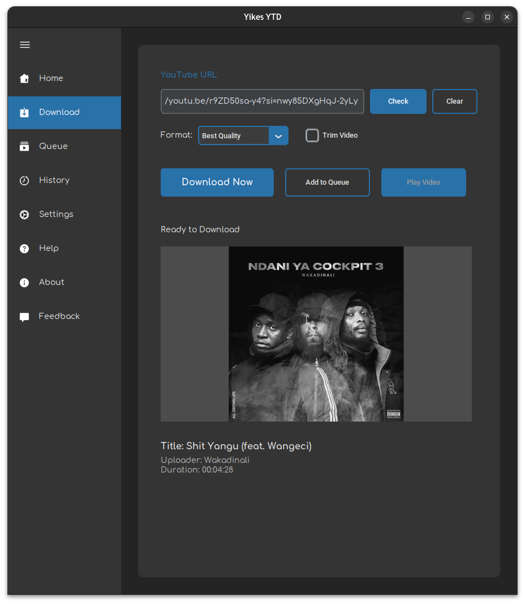

---

## ✨ Premium Features

### 🎨 State-of-the-Art UI/UX
- **Dynamic Theme Engine**: Change accent colors in real-time. Whether it's Blue, Orange, or Green, the UI adapts instantly.
- **Adaptive Sidebar**: A fully responsive sidebar that can collapse to save space without losing functionality.
- **Micro-Animations**: Smooth transitions and hover effects for a premium feel.

### ⚡ Unmatched Performance
- **Powered by `yt-dlp`**: The gold standard in video extraction, guaranteed to be fast and stable.
- **Multi-Format Mastery**: Support for 4K, 2K, 1080p, 720p (MP4), high-bitrate MP3, WAV, M4A, and even GIF conversion.
- **Intelligent Quality Detection**: Automatically verifies if your selected quality is available for a video and provides smart recommendations.
- **Advanced Playlist Management**: Automatically detects playlists and organizes them into dedicated, sanitized folders.

---

## 📸 Exploring the Application

### 📥 The Download Hub
Experience a streamlined workflow for both individual videos and massive playlists.

````carousel
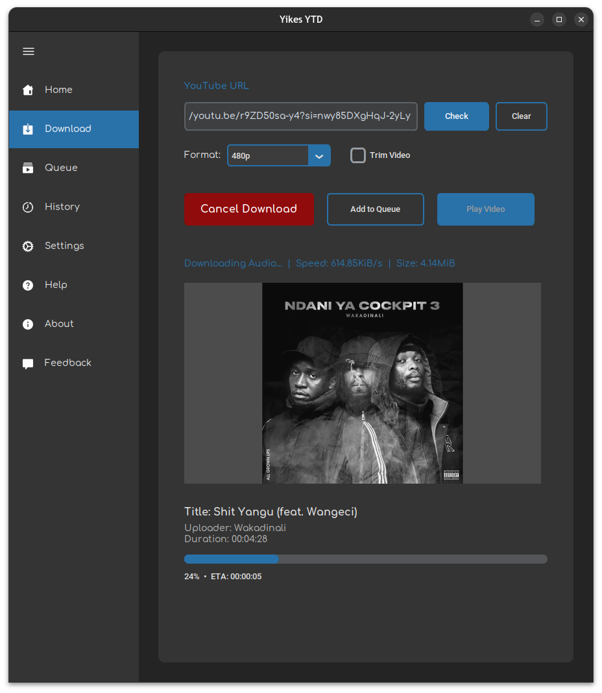
<!-- slide -->
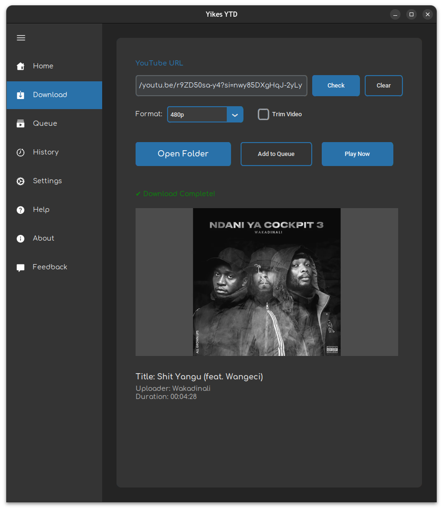
<!-- slide -->
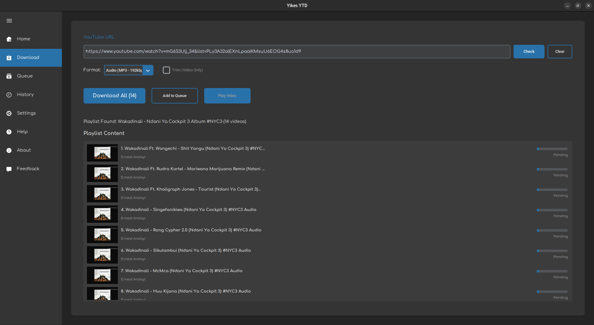
<!-- slide -->
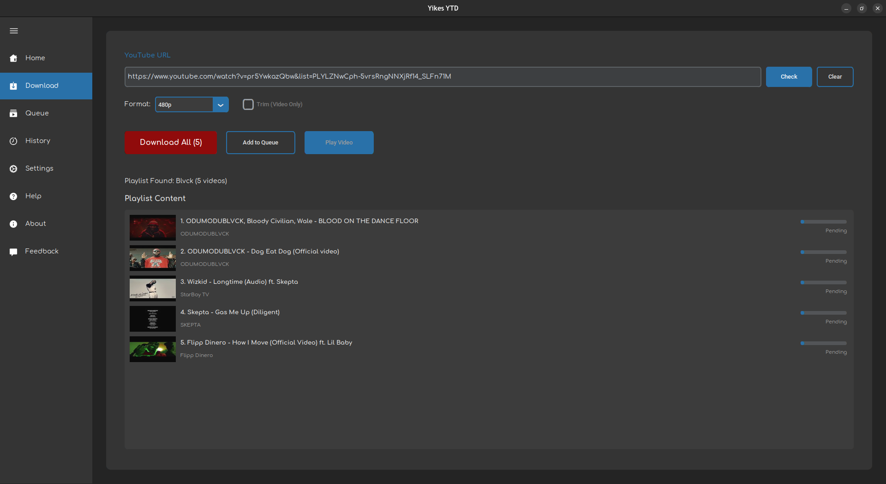
<!-- slide -->
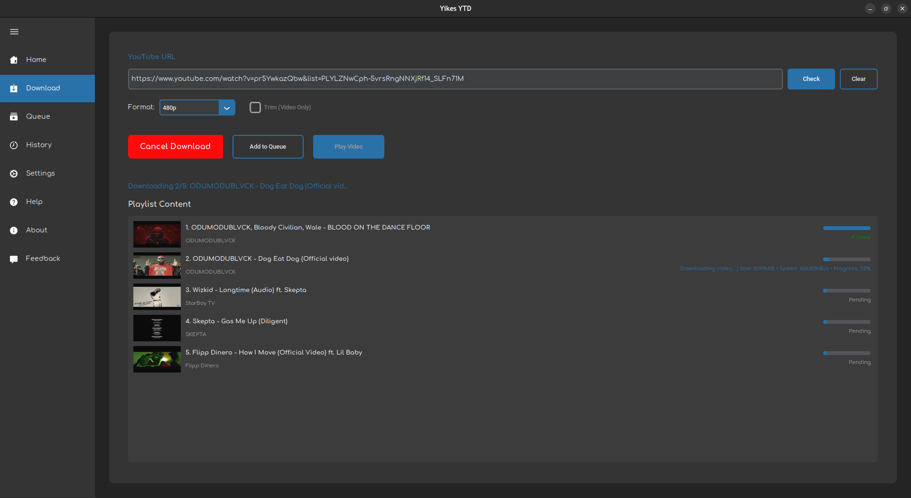
````

> [!TIP]
> **Yikes YTD** handles the heavy lifting of metadata extraction and folder organization, ensuring your library stays perfectly organized.

### 🕒 History & Theming
Track your downloads and express your style with our live accent color system.

````carousel
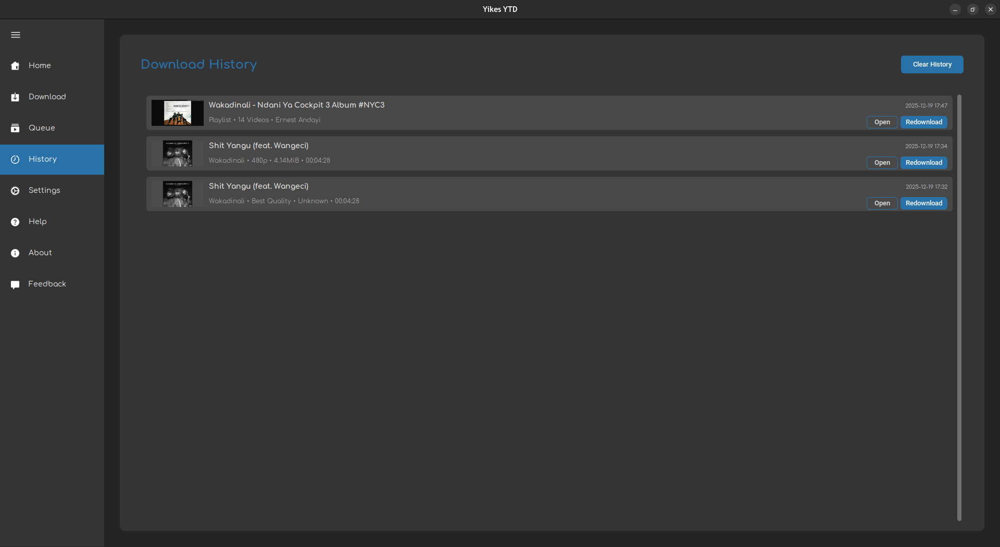
<!-- slide -->
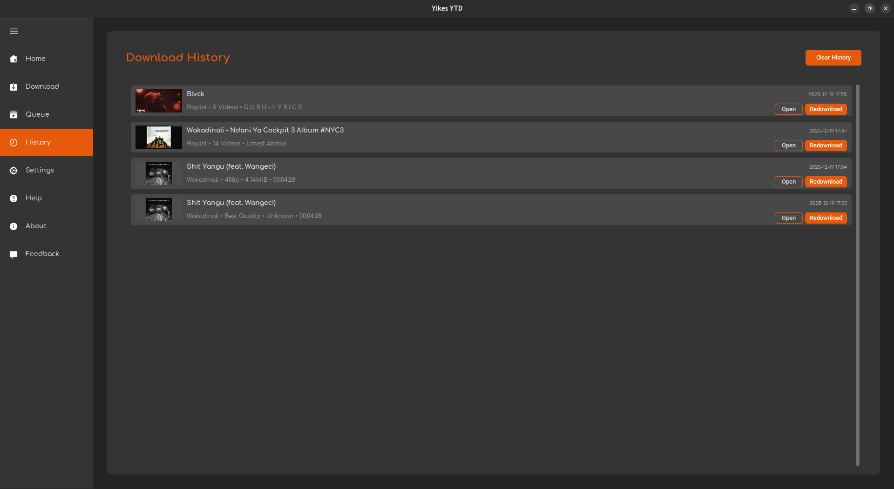
<!-- slide -->

````

### ⚙️ Page Gallery
Every corner of **Yikes YTD** is crafted for clarity and ease of use.

| Page | Description | Visual |
| :--- | :--- | :--- |
| **Settings** | Control your download path, theme accents, and app behavior. | 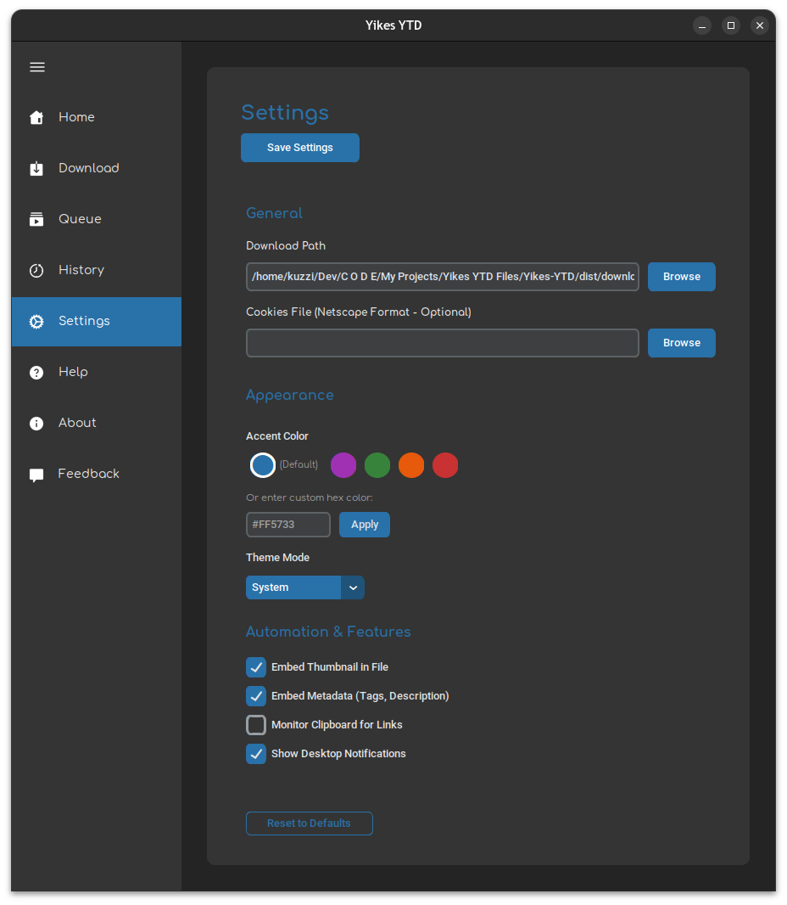 |
| **Help** | Integrated user guide covering all features and troubleshooting. | 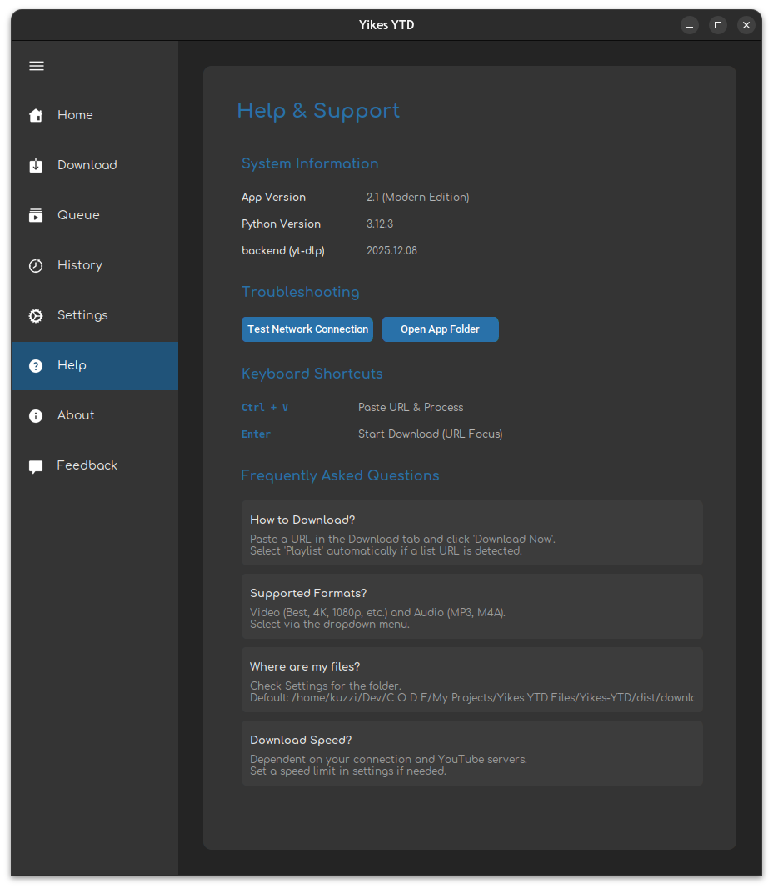 |
| **Feedback** | We value your voice. Send suggestions directly from the app. | 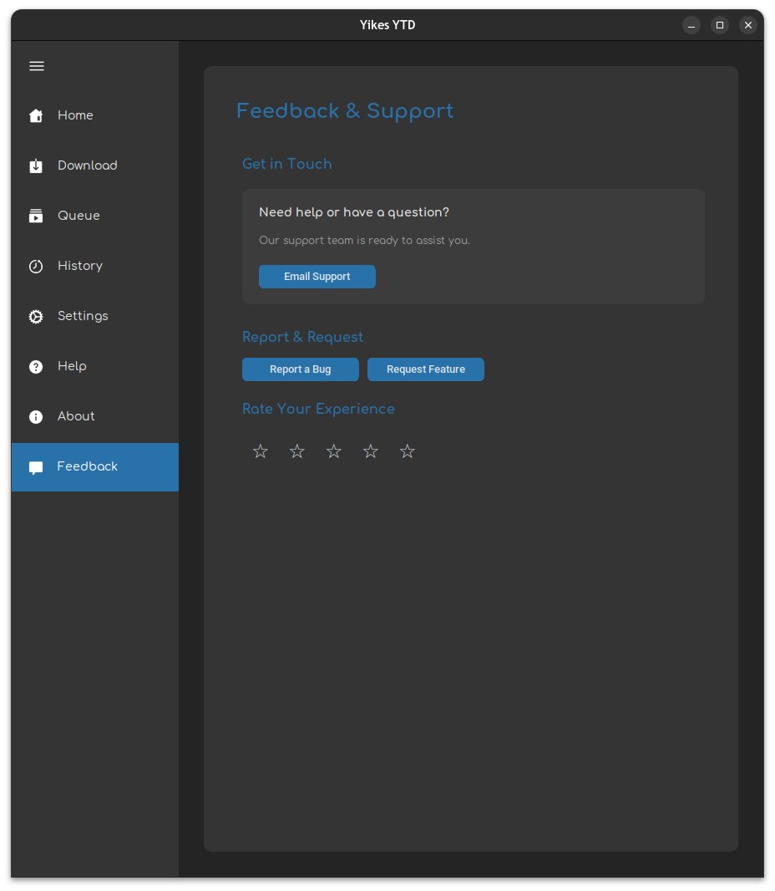 |
| **About** | Version info, credits, and links to our community. | 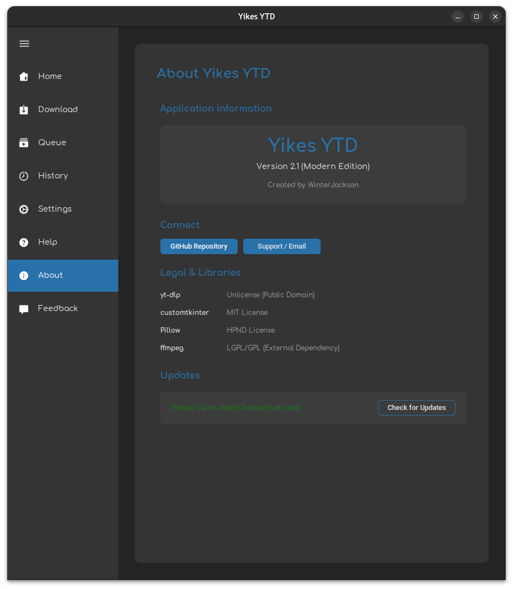 |

---

## 🚀 Getting Started

### Prerequisites
- **Python 3.10+** (Recommended for local development)
- **FFmpeg**: 
    - **Linux**: ✅ **Bundled!** No installation required.
    - **Windows/macOS**: Essential for merging high-quality streams. [Download here](https://ffmpeg.org/download.html).

### Setup & Run
```bash
# Clone the repository
git clone https://github.com/WinterJackson/Yikes-YTD.git
cd Yikes-YTD

# Install dependencies
pip install -r requirements.txt

# Start Application
python main.py
```

### Build a Standalone App
Generate a native executable for your OS using our optimized build config:
```bash
pip install pyinstaller
pyinstaller "Yikes YTD.spec"
```
The result will be located in the `dist/` folder.

---

## 🤝 Acknowledgements
- **CustomTkinter**: The foundation for our modern look.
- **yt-dlp**: The engine that makes high-speed downloads possible.

---
© 2025 Winter Jackson - Built with ❤️ for the community.
